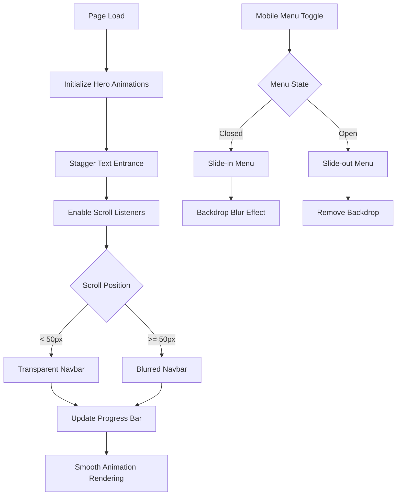
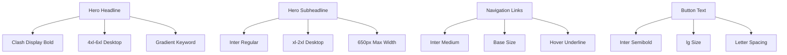

# Hero Redesign & Dynamic Navbar Design

## Overview

This design outlines the transformation of the REX Agent landing page to feature a bold, text-focused hero section with dynamic gradient effects and a responsive sticky navigation system. The redesign emphasizes visual impact through typography, gradients, and smooth animations while maintaining excellent user experience across all devices.

### Design Goals
- Create a striking, text-only hero section with gradient effects and large typography
- Implement a dynamic navbar that adapts to scroll behavior
- Ensure seamless responsive design across all screen sizes
- Maintain performance with optimized animations and smooth transitions
- Establish a cohesive dark-themed aesthetic throughout the interface

## Technology Stack & Dependencies

The redesign leverages the existing Next.js 14 application with the following key technologies:

| Technology | Purpose | Current Version |
|------------|---------|-----------------|
| Next.js | React framework | 14.2.5 |
| Framer Motion | Animation library | 11.11.1 |
| Tailwind CSS | Styling framework | 3.4.4 |
| TypeScript | Type safety | 5.5.3 |
| Radix UI | Accessible components | Various |
| Lucide React | Icon library | 0.487.0 |

### Additional Requirements
- Custom font integration (Clash Display or Satoshi Bold for headlines)
- Enhanced gradient utilities in Tailwind configuration
- Scroll-based animation triggers
- Viewport-based responsive breakpoints

## Component Architecture

### Component Hierarchy
```
App Layout
├── Dynamic Navbar
│   ├── Navigation Links
│   ├── Mobile Menu
│   └── CTA Button
├── Hero Section
│   ├── Headline with Gradient Text
│   ├── Subheadline
│   └── CTA Button Row
└── Scroll Progress Indicator
```

### Component Definition

#### HeroSection Component
**Purpose**: Primary landing section featuring large typography and call-to-action elements

**Key Properties**:
- Full viewport height (min-h-[90vh])
- Dark gradient background
- Centered text alignment with left-aligned content on desktop
- Scroll-triggered animations with staggered timing

**State Management**:
- Animation trigger states based on scroll position
- Text visibility states for staggered entrance effects
- Responsive layout states for mobile optimization

#### DynamicNavbar Component
**Purpose**: Adaptive navigation that responds to scroll position and provides site navigation

**Key Properties**:
- Sticky positioning at top of viewport
- Transparent initial state, transitioning to blurred dark background
- Responsive navigation with hamburger menu for mobile
- Smooth transition animations between states

**State Management**:
- Scroll position tracking for background transitions
- Mobile menu open/closed state
- Active navigation item highlighting

#### ScrollProgressIndicator Component
**Purpose**: Visual indicator of page scroll progress

**Key Properties**:
- Fixed position at top of viewport
- Gradient progress bar that fills based on scroll percentage
- Minimal visual footprint with subtle gradient effect

## Styling Strategy

### Color Palette & Gradients

#### Background Gradients
| Gradient Name | Color Stops | Usage |
|---------------|-------------|-------|
| Hero Background | from-[#0f0f1a] via-[#111827] to-[#1a1f3c] | Main hero section background |
| Text Gradient | from-violet-400 via-blue-500 to-teal-400 | Keyword highlighting in headline |
| Button Primary | from-violet-600 to-blue-600 | Primary CTA button |
| Button Secondary | Transparent with colored border | Secondary CTA button |
| Navbar Blur | backdrop-blur-md with bg-black/80 | Scrolled navbar background |

#### Typography Scale
| Element | Font Family | Size (Desktop) | Size (Mobile) | Weight |
|---------|-------------|----------------|---------------|---------|
| Hero Headline | Clash Display/Satoshi Bold | 4xl-6xl | 3xl-4xl | 700-900 |
| Hero Subheadline | Inter/General Sans | xl-2xl | lg-xl | 400-500 |
| Navigation Links | Inter | base | sm | 500 |
| Button Text | Inter | lg | base | 600 |

### Responsive Design Strategy

#### Breakpoint Behavior
- **Mobile (< 768px)**: Single column layout, stacked CTAs, hamburger navigation
- **Tablet (768px - 1024px)**: Adjusted typography scale, maintained single column
- **Desktop (> 1024px)**: Full design implementation with optimal spacing

#### Layout Adaptations
- Hero text: Scales down proportionally across breakpoints
- Navigation: Collapses to hamburger menu on mobile
- CTA buttons: Stack vertically on small screens
- Maximum content width: 650px for subheadline readability

## Routing & Navigation

### Navigation Structure
| Link | Destination | Behavior |
|------|-------------|----------|
| Features | #features | Smooth scroll to features section |
| Pricing | #pricing | Smooth scroll to pricing section |
| Docs | /docs | External navigation to documentation |
| About | #about | Smooth scroll to about section |
| Join Waitlist | /waitlist | Call-to-action navigation |

### Mobile Navigation
- Slide-in panel from right side
- Full-screen overlay with dark background
- Large, touch-friendly navigation links
- Smooth enter/exit animations with backdrop blur

## State Management

### Animation States
The application manages several animation states for optimal user experience:

#### Scroll-Based States
- **Initial State**: Elements positioned off-screen or with zero opacity
- **Triggered State**: Elements animate to final positions with staggered timing
- **Navbar State**: Transparent to blurred background transition based on scroll threshold

#### Component States
```
Hero Animation Sequence:
1. Headline fade-in + slide-up (0ms delay)
2. Subheadline fade-in + slide-up (200ms delay)  
3. CTA buttons fade-in + slide-up (400ms delay)

Navbar Transition:
- Scroll position < 50px: Transparent background
- Scroll position >= 50px: Blurred dark background with border glow
```

## Motion & UX Design

### Animation Specifications

#### Timing & Easing
| Animation Type | Duration | Easing | Trigger |
|----------------|----------|--------|---------|
| Hero Text Entrance | 200-400ms | ease-out | On page load |
| Navbar Background | 300ms | ease-in-out | Scroll threshold |
| Button Hover | 200ms | ease-out | Mouse enter/leave |
| Mobile Menu | 250ms | ease-out | Menu toggle |
| Scroll Progress | Linear | N/A | Scroll position |

#### Entrance Animations
- **Fade + Slide**: Elements start 30px below final position with 0 opacity
- **Staggered Timing**: Each element delayed by 200ms from previous
- **Gradient Text**: Subtle pulse effect on keyword highlighting

#### Interactive Animations
- **Button Hover**: Glow effect expansion and color intensity increase
- **Link Hover**: Underline animation from left to right
- **Mobile Menu**: Slide-in from right with backdrop blur

### Scroll Progress Implementation
- Thin gradient bar (2px height) at top of viewport
- Color gradient matching brand palette (violet to blue to teal)
- Smooth fill animation based on document scroll percentage
- Non-intrusive visual presence with subtle glow effect

### Performance Considerations
- Hardware-accelerated transforms for smooth animations
- Reduced motion preferences respected via CSS media queries
- Optimized re-renders through proper state management
- Lazy loading for non-critical animations

## Testing Strategy

### Animation Testing
- **Smooth Performance**: Verify 60fps animation performance across devices
- **Timing Accuracy**: Confirm staggered animation timing matches specifications
- **State Transitions**: Test navbar background transitions at various scroll speeds
- **Mobile Interactions**: Validate touch interactions and menu animations

### Responsive Testing
- **Breakpoint Behavior**: Confirm layout adaptations at all breakpoints
- **Typography Scaling**: Verify readable text sizes across devices
- **Touch Targets**: Ensure mobile buttons meet accessibility size requirements
- **Navigation Functionality**: Test hamburger menu and scroll navigation

### Cross-Browser Compatibility
- **Gradient Support**: Verify gradient effects across modern browsers
- **Animation Performance**: Test Framer Motion animations in different environments
- **Font Loading**: Confirm custom font fallbacks and loading behavior
- **Backdrop Blur**: Test navbar blur effects with fallback styles

### Accessibility Testing
- **Keyboard Navigation**: Ensure all interactive elements are keyboard accessible
- **Screen Reader**: Verify proper semantic structure and ARIA labels
- **Reduced Motion**: Test animation behavior with motion preferences disabled
- **Color Contrast**: Confirm text readability against gradient backgrounds

## Visual Design Specifications

### Layout Measurements
| Element | Desktop | Tablet | Mobile |
|---------|---------|--------|--------|
| Hero Section Height | min-h-[90vh] | min-h-[80vh] | min-h-[70vh] |
| Headline Max Width | 100% | 90% | 95% |
| Subheadline Max Width | 650px | 600px | 90% |
| Navbar Height | 80px | 70px | 60px |
| Button Padding | px-8 py-4 | px-6 py-3 | px-6 py-3 |

### Animation Timing Chart

```mermaid
gantt
    title Hero Section Animation Sequence
    dateFormat X
    axisFormat %Lms
    
    section Text Elements
    Headline Fade-in    :0, 400
    Subheadline Fade-in :200, 600
    CTA Buttons Fade-in :400, 800
    
    section Interactive
    Hover Effects       :0, 200
    Navbar Transition   :active, 300
```



### Component Interaction Flow



### Typography Hierarchy




